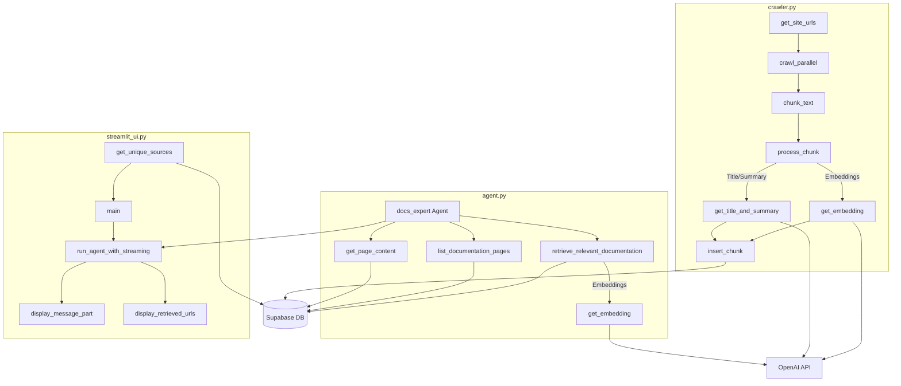

# Advanced RAG Documentation Assistant

This project implements an advanced Retrieval-Augmented Generation (RAG) system for documentation search and Q&A. It combines web crawling, vector embeddings, and a Streamlit interface to create an intelligent documentation assistant.

## Features

- **Smart Web Crawling**: Automatically crawls documentation websites with intelligent handling of sitemaps and recursive link discovery
- **Chunking & Embedding**: Processes documentation into semantic chunks with OpenAI embeddings
- **Vector Search**: Uses Supabase for efficient vector similarity search
- **Interactive UI**: Streamlit-based interface for easy interaction with the documentation
- **Source Filtering**: Ability to filter searches by specific documentation sources
- **Streaming Responses**: Real-time streaming of AI responses with citation tracking

## System Components

1. **Crawler (`crawler.py`)**:
   - Handles parallel web crawling with concurrency control
   - Smart text chunking with respect to code blocks and paragraphs
   - Generates embeddings and metadata for each chunk
   - Stores processed content in Supabase

2. **Agent (`agent.py`)**:
   - Implements an expert AI agent using pydantic-ai
   - Provides tools for documentation retrieval and search
   - Maintains conversation context and history
   - Generates well-structured responses with analysis and code examples

3. **UI (`streamlit_ui.py`)**:
   - Interactive chat interface
   - Real-time response streaming
   - Source selection and filtering
   - Display of retrieved documentation sources

## System Architecture



## Setup Instructions

### 1. Environment Setup

```bash
# Create and activate virtual environment
python -m venv venv
source venv/bin/activate  # On Windows: venv\Scripts\activate
pip install -r requirements.txt
```

### 2. Environment Variables

1. Rename `.env.example` to `.env`
2. Configure your environment variables:
```
OPENAI_API_KEY=your_openai_api_key
SUPABASE_URL=your_supabase_url
SUPABASE_SERVICE_KEY=your_supabase_service_key
LLM_MODEL=gpt-4o-mini  # or your preferred OpenAI model
```

### 3. Database Setup

1. Set up a Supabase project
2. Execute the SQL commands in `supabase_functions.sql` to:
   - Create the site_pages table
   - Enable vector similarity search
   - Set up Row Level Security policies
   - Create helper functions

To execute the SQL:
1. Go to Supabase Dashboard → SQL Editor
2. Paste the contents of `supabase_functions.sql`
3. Click "Run"

## Usage Guide

### 1. Crawling Documentation

To populate the vector database with documentation:

```bash
python crawler.py
```

This will:
- Fetch URLs from documentation sitemaps or crawl recursively
- Process pages into semantic chunks
- Generate embeddings using OpenAI's API
- Store everything in Supabase

### 2. Running the Interface

Launch the Streamlit interface:

```bash
streamlit run streamlit_ui.py
```

The interface will be available at `http://localhost:8501`

### Using the Chat Interface

1. **Select Sources**: Use the multiselect dropdown to choose which documentation sources to search
2. **Ask Questions**: Type your questions in the chat input
3. **View Results**: 
   - See real-time streaming responses
   - Check the sidebar for source citations
   - Review code examples and explanations

## Architecture Details

### Document Processing

1. **Chunking Strategy**:
   - Respects code blocks (```)
   - Maintains paragraph integrity
   - Adaptive chunk sizes (default 5000 chars)
   - Preserves context in splits

2. **Vector Storage**:
   - Uses OpenAI's text-embedding-3-small model
   - Stores 1536-dimensional vectors
   - Enables semantic similarity search

3. **RAG Implementation**:
   - Hybrid search using vector similarity
   - Source filtering capabilities
   - Structured response format with analysis and citations

## Embedding Analysis

The project includes an embedding analysis tool (`embedding_analysis.py`) that helps visualize and analyze the vector embeddings using Nomic Atlas. This tool is useful for:

- Visualizing the semantic relationships between documents
- Identifying clusters of similar content
- Analyzing the distribution of topics across the documentation

### Usage

1. Make sure you have a Nomic API key in your `.env` file:
```
NOMIC_API_KEY=your_nomic_api_key
```

2. Run the analysis:
```bash
python embedding_analysis.py
```

The tool will:
- Fetch document data from Supabase
- Create embeddings using Nomic's Atlas service
- Generate interactive visualizations accessible through the Atlas UI

### Features

- **Topic Modeling**: Automatically identifies and clusters similar content
- **Interactive Visualization**: Explore document relationships in 3D space
- **URL-based Analysis**: Groups content by domain for source-based insights
- **Large-scale Processing**: Can handle up to 100,000 document chunks
